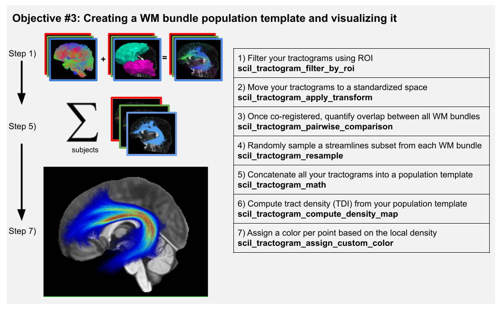

.. _page_population_template:

Creating a WM bundle population template
========================================

Scilpy scripts enable users to create a WM bundle population template, such as described in figure 3 in our upcoming paper. Such a pipeline includes:

1) segmenting the bundle of interest in each subject’s tractogram. The segmentation of bundles can be based on ROIs of inclusion / exclusion (`scil_tractogram_segment_with_ROI_and_score` or `scil_tractogram_filter_by_roi`) or based on the general shape of the streamlines (`scil_tractogram_segment_with_recobundles`, `scil_tractogram_segment_with_bundleseg`). See :ref:`page_tractogram_segmentation` for more information on this.

2) registering the bundles to a reference space (e.g., MNI space) and analysing the inter-subject variability,

3) combining them into a reference bundle template, similarly to how one would average many structural MRI images to create a brain template.

4) analysing the results.

Then, registration can be performed (see :ref:`page_tractogram_registration`). The tractograms can be downsampled and concatenated (see :ref:`page_tractogram_math`) and even concatenated to their flipped version to obtain a symmetrical template.

