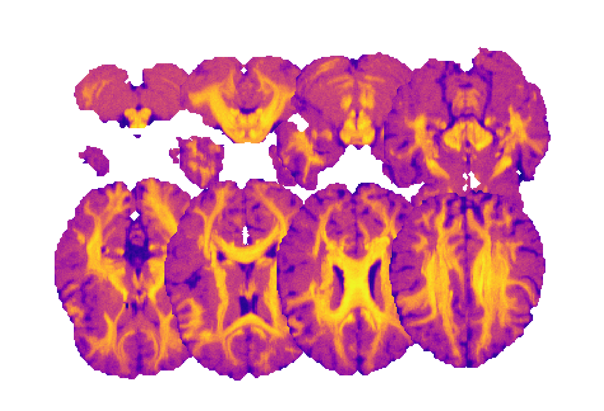
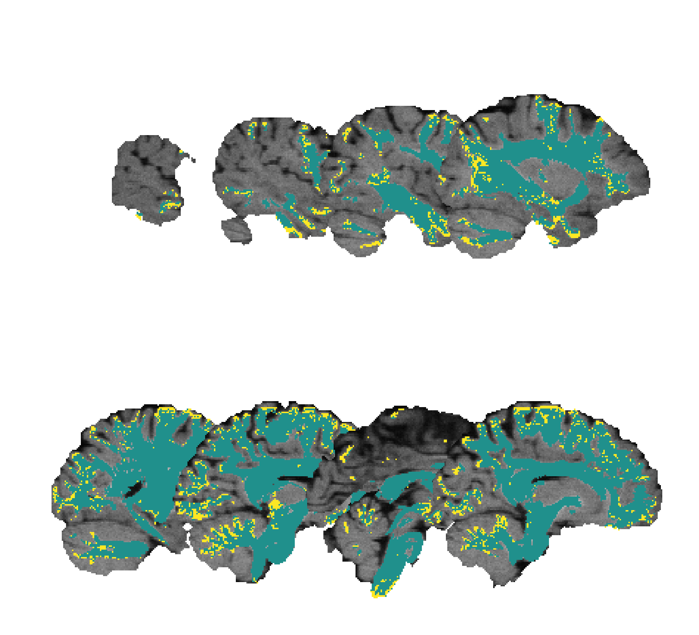

Create overlapping slice mosaics
================================

Screenshots to a series of volume image slices that overlap according to a
given factor and arranged into a mosaic can be created using the
`scil_screenshot_volume_mosaic_overlap.py` script. The script takes an input
volume (e.g. a brain T1-weighted MRI volume, or a discrete tissue segmentation
volume) and a mask (e.g. the brain mask volume), and generates a mosaic
according to the requested layout (e.g. row-only, column-only, or matrix). The
mask is used as a transparency mask, i.e. it sets the corresponding screenshot
values outside the mask non-zero values to full transparency.

Additionally, if a labelmap image is provided (e.g. a tissue segmentation map),
it is overlaid on the volume slices.

A labelmap image can be provided as the image volume, without requiring it as
the optional argument if only the former needs to be plot.

The screenshots are overlapped according to the given factors.

Colormap names can be specified to map the values of the volume and the
labelmap images to some given colors.

A T1-weighted MRI in a row-only layout:

.. image:: ../_static/scil_screenshot_volume_mosaic_overlap_t1.png
   :scale: 20%

A T1-weighted MRI in matrix layout and with a colormap applied:

A labelmap image in matrix layout and with a colormap applied:

.. image:: ../_static/scil_screenshot_volume_mosaic_overlap_tissue_map.png
   :scale: 20%

A T1-weighted MRI and an overlaid labelmap image in matrix layout and with a
colormap applied:

The data used to generate these figures correspond to the ISMRM 2015
Tractography Challenge Dataset [1]_. The T1-weighted image and brain mask
images were used as-is; the tissue maps were simulated by composing a mask with
all the bundle masks, and another separate mask with all the bundle endpoint
masks. The data was obtained from `tractometer.org`_.

.. [1] Maier-Hein, K., Neher, P., Houde, J.-C., Caruyer, E., Daducci, A.,
       Dyrby, T., Bram, S. and Descoteaux, M. (2015). Tractography Challenge
       ISMRM 2015 Data [Data set]. Zenodo.
       https://doi.org/10.5281/zenodo.572345

.. _tractometer.org: http://www.tractometer.org/
